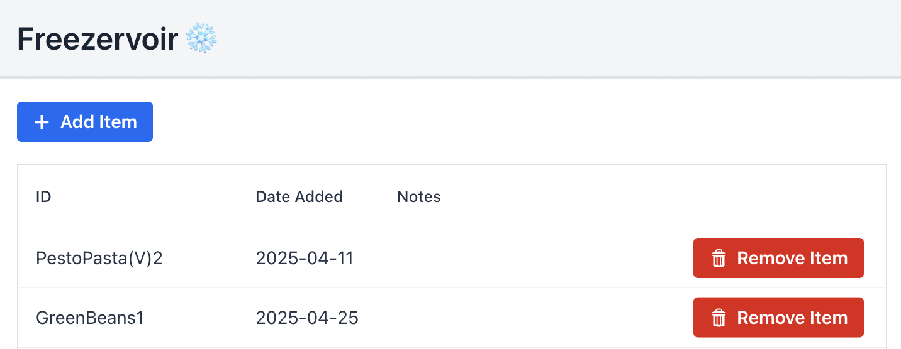
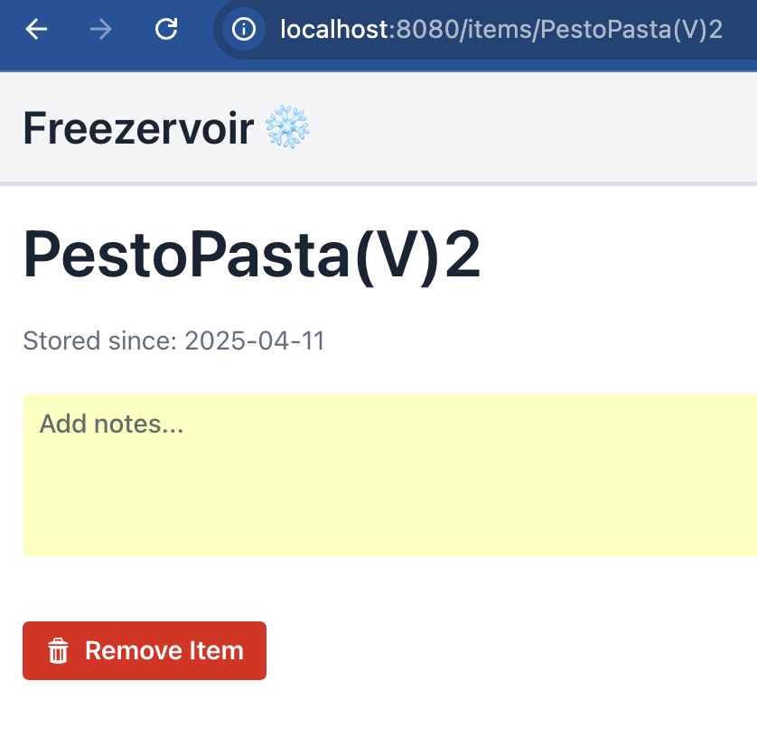
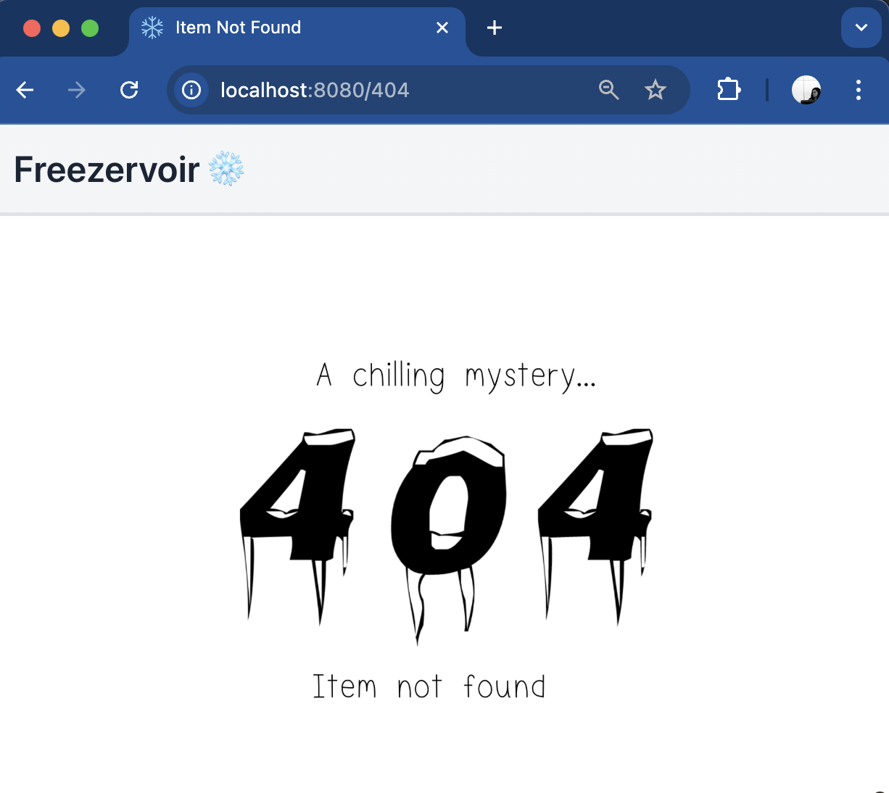

<p align="center" xmlns="http://www.w3.org/1999/html">
  
</p>
<p align="center"> 🚧 <strong>Status:</strong> In Development </p>
<p align="center"> 🏗️ <strong>Tech Stack:</strong> Java 21 • Spring Boot • Maven • Vaadin • MySQL </p>

___
## Motivation

The household freezer is often chock-a-block with leftover meals, pre-portioned ingredients, batch-cooked items, and other frozen goods. Having been brought up with annual “freezer reviews”, where everything was taken out, spread across a blanket outside, and logged, keeping track of food has been long ingrained in me. Last year, I decided there had to be a better way and designed a simple tracking system using QR-code labels (via a label maker) and a Google Sheet. This approach has been invaluable, giving clear visibility of what’s available and proving especially useful on days when I (or others) need a ready-made meal quickly.

However effective, the process is still very manual. It involves:

- Creating records 
- Printing QR stickers and placing them on freezer packaging 
- Removing QR stickers when an item is used 
- Scanning the removed stickers to retrieve their IDs 
- Updating or deleting the associated record

The final two steps are where things tend to stall, often getting postponed in favour of eating, and they leave a growing pile of stickers to deal with later.
This incentivised the need for this project, which will migrate the current process to an automated one.

The design supports future extensions, including notifications for "stagnant" items and AI-assisted meal suggestions. The continued objective is to transform the freezer from a mysterious reservoir into an active part of reducing waste, household spending, and guesswork.


___
## Roadmap
The below table shows the planned stages of the project. These are subject to change as the project evolves.

| Stage | Title                               | Description                                                                                                                                                                                                                    | Status |
|------:|-------------------------------------|--------------------------------------------------------------------------------------------------------------------------------------------------------------------------------------------------------------------------------|--------|
|     1 | View Current Freezer Items          | Created a MySQL representation of the current Google Sheet data, added JPA architecture to read from the database, and added frontend logic to display items in a table.                                                       | ✅      |
|     2 | CRUD Basics                         | Add frontend functionality to add and delete items, validate these actions, and communicate correctly with the backend. After this stage, the original system will be fully replicated.                                        | ✅     |
|     3 | QR-Driven Item Pages                | Generate QR codes that point to item detail pages, allowing delete actions via the UI. Will also see removal of Controller files/direct endpoints to prevent accidental data modification. (Initial Goal for Project Achieved) | ✅     |
|     4 | Schema Migration & Physical Rollout | Replace the existing table with an improved schema and migrate all legacy data. Implement ID generation, assign QR codes to all items, and relabel every freezer item to align the real-world inventory with the new system.   | ✅     |
|     5 | UI Improvements + Notes Feature     | Add filters and sorting, with default order earliest → latest. Display item count and allow custom labels, e.g. missing. Improve UI layout and clarity.                                                     |        |
|     6 | Deployment                          | Deploy the application so the server runs continuously.                                                                                                                                                                        |        | 
|     7 | Account Setup & Permissions         | Account functionality/setup to enable permissions for future improvements.                                                                                                                                                     |        |
|     8 | Expiry Tracking                     | Notify when an item is approaching expiry (e.g. 1 year from date added).                                                                                                                                                       |        |
|     9 | UX & Workflow Cleanup               | Improve branding and overall UX, and refine the app → label workflow.                                                                                                                                                          |        |
|    10 | AI Enhancements                     | Suggest meals based on freezer contents. Replace manual data entry with camera-based capture. Use AI to suggest item descriptions and estimate realistic expiry dates.                                                         |        |

Project Task Board can be found [here](https://www.notion.so/3021d997b6f180658671d3fb19ca452c?v=3021d997b6f1804bbda3000c944dca9d&source=copy_link).
___
## ▶ Run Locally
To use this project, you will need to do the following:
### Prerequisites

- Java 21 installed and set as your active JDK 
- Maven (or use the Maven Wrapper included in the project)
- MySQL running locally

### Steps
The below instructions apply to the legacy architecture as the new framework is still in development.

1. Clone the repository

```bash
git clone git@github.com:helenijevans/freezervoir.git
cd freezervoir
```


2. Set up the database 
   - Start your MySQL server 
   - Run the [provided SQL setup script](src/main/resources/init_db.sql) to create the legacy_freezer_items table 
   - Use SQL commands to insert your own data into legacy_freezer_items 

3. Configure database credentials 
   - Either:
     - Set environment variables for MYSQL_USERNAME and MYSQL_PASSWORD 
     - Edit `src/main/resources/application.yaml` and set your username/password directly. 
4. Run the application 
   - From IDE: Open the project → Run the Application class 
   - From the terminal: ```mvn spring-boot:run```
5. Open in browser at http://localhost:8080/legacy

### Result
You should see:
- A grid listing your current freezer items from the database
- Delete functionality including confirmation pop-up
- Add functionality for new freezer items
- Item Pages (through grid selection and/or manual URL navigation)
  - Including delete and edit notes functionality
  - 404 Page if Item doesn't exist

| Page | Expected View                                            |
|------|----------------------------------------------------------|
| Root | <br> |
| /items/{itemID} | <br> |
| /404 | <br> |


### Testing
To run the project's test suite, use the terminal command ```mvn test```
