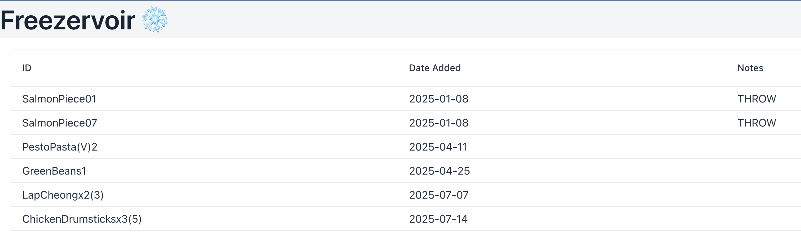

<p align="center" xmlns="http://www.w3.org/1999/html">
  
</p>
<p align="center"> 🚧 <strong>Status:</strong> Early Development  </p>
<p align="center"> 🏗️ <strong>Tech Stack:</strong> Java 21 • Spring Boot • Maven • Vaadin • MySQL </p>

___
## Motivation

The household freezer is often chock-a-block with leftover meals, pre-portioned ingredients, batch-cooked items, and other frozen goods. Having been brought up with annual “freezer reviews”, where everything was taken out, spread across a blanket outside, and logged, keeping track of food has been long ingrained in me. Last year, I decided there had to be a better way and designed a simple tracking system using QR-code labels (via a label maker) and a Google Sheet. This approach has been invaluable, giving clear visibility of what’s available and proving especially useful on days when I (or others) need a ready-made meal quickly.

However effective, the process is still very manual. It involves:

- Creating records 
- Printing QR stickers and placing them on freezer packaging 
- Removing QR stickers when an item is used 
- Scanning the removed stickers to retrieve their IDs 
- Updating or deleting the associated record

The final two steps are where things tend to stall, often getting postponed in favour of eating, and they leave a growing pile of stickers to deal with later.
This incentivised the need for this project, which will migrate the current process to an automated one.

The design supports future extensions, including notifications for "stagnant" items and AI-assisted meal suggestions. The continued objective is to transform the freezer from a mysterious reservoir into an active part of reducing waste, household spending, and guesswork.

___
## ▶ Run Locally
To use this project, you will need to do the following:
### Prerequisites

- Java 21 installed and set as your active JDK 
- Maven (or use the Maven Wrapper included in the project)
- MySQL running locally

### Steps

1. Clone the repository

```bash
git clone git@github.com:helenijevans/freezervoir.git
cd freezervoir
```


2. Set up the database 
   - Start your MySQL server 
   - Run the [provided SQL setup script](src/main/resources/init_db.sql) to create the freezer_items table 
   - Use SQL commands to insert your own data into freezer_items 

3. Configure database credentials 
   - Either:
     - Set environment variables for MYSQL_USERNAME and MYSQL_PASSWORD 
     - Edit `src/main/resources/application.yaml` and set your username/password directly. 
4. Run the application 
   - From IDE: Open the project → Run the Application class 
   - From the terminal: ```mvn spring-boot:run```
5. Open in browser at http://localhost:8080

### Result
You should see:
- The Freezervoir header
- A grid listing your current freezer items from the database


